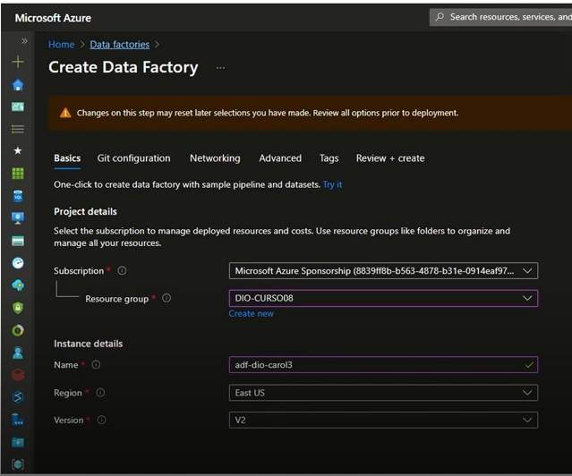
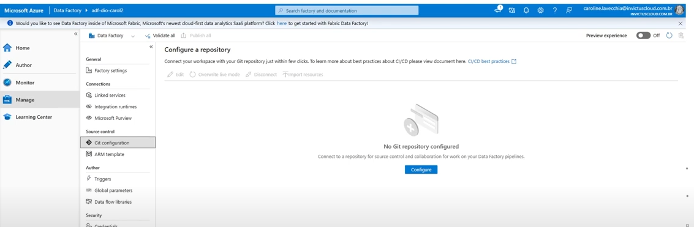
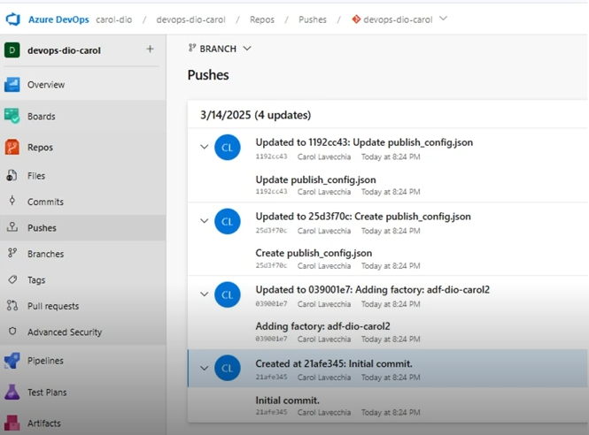
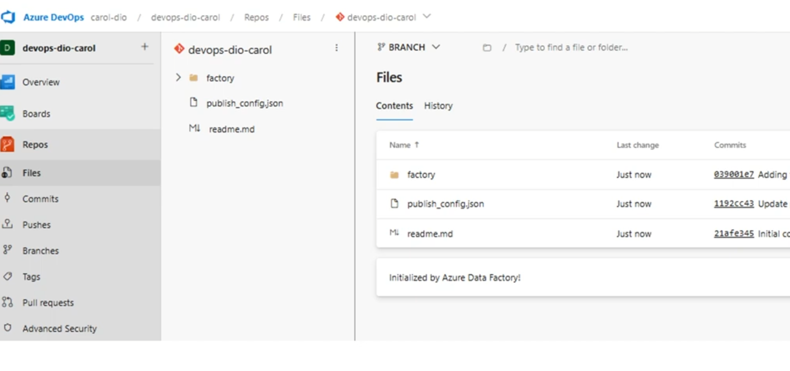
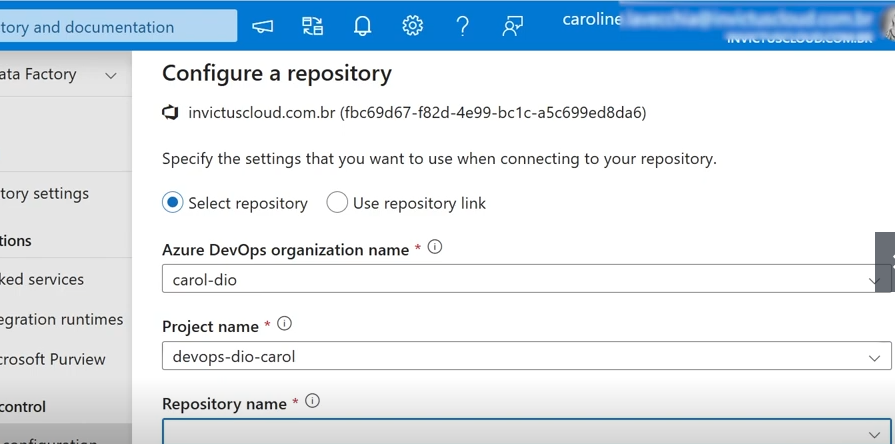

# 🔧 Integração do Azure DevOps com Azure Data Factory

Este repositório tem como objetivo demonstrar, de forma prática e visual, a integração do **Azure DevOps** com o **Azure Data Factory (ADF)**. Essa integração permite versionar pipelines, colaborar em equipe e realizar deploys controlados com muito mais segurança e agilidade.

## 📌 Visão Geral

O Azure Data Factory é um serviço de integração de dados baseado em nuvem que permite criar, agendar e gerenciar fluxos de trabalho de dados em escala. Integrando-o ao Azure DevOps, é possível:

- Armazenar artefatos do ADF em repositórios Git;
- Rastrear mudanças em pipelines com controle de versão;
- Automatizar implantações entre ambientes (por exemplo: Dev, Homologação e Produção).

---

## 🖼️ Telas e Etapas

### 1️⃣ Tela de Criação do Data Factory  
  
> Nesta imagem, mostramos o início da criação do recurso Azure Data Factory dentro do portal Azure. Aqui, definimos nome, região e grupo de recursos.

### 2️⃣ Tela Básica de Configuração do Repositório  
  
> Ao acessar o ADF pela primeira vez, é possível conectar a um repositório Git. Esta tela mostra a opção de vincular o ambiente a um projeto no Azure DevOps.

### 3️⃣ Tela de Pushs  
  
> Depois de criar ou editar pipelines no modo de desenvolvedor, as alterações são salvas e enviadas (push) para o repositório configurado. Essa tela mostra um histórico dos commits feitos.

### 4️⃣ Tela de Configuração do DevOps  
  
> Dentro do Azure DevOps, esta tela mostra a criação do pipeline de CI/CD, onde definimos os gatilhos e tarefas de automação para publicação do conteúdo no ADF.

### 5️⃣ Tela de Configuração do Repositório (Definindo as Configurações)  
  
> Aqui detalhamos as configurações feitas no repositório Git dentro do Azure DevOps, como a definição da branch principal (main) e a conexão segura com o ADF.

---

## 🧠 Conclusão

A integração entre Azure DevOps e Azure Data Factory traz grandes benefícios no ciclo de vida do desenvolvimento de dados, promovendo maior controle, automação e rastreabilidade. Este repositório serve como guia visual e prático para essa configuração.

---

📌 **Dica**: Certifique-se de ter permissões adequadas em ambos os serviços (Azure e DevOps) e mantenha suas branches organizadas para facilitar a colaboração em equipe.
